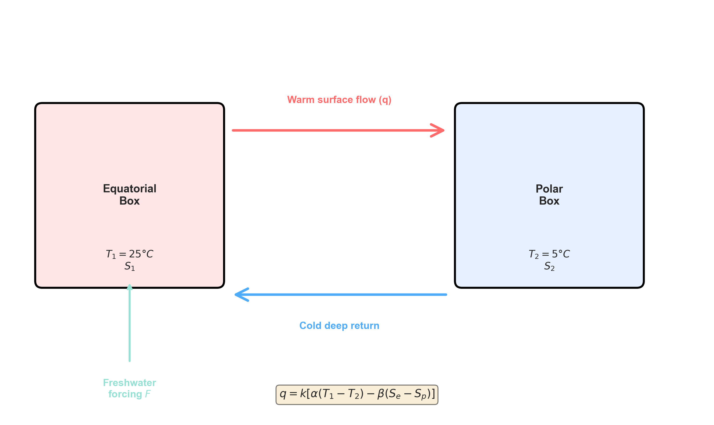
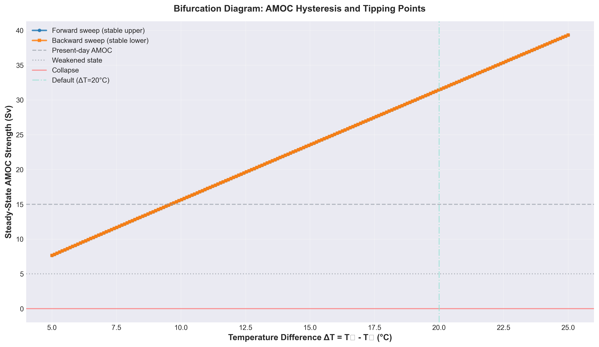
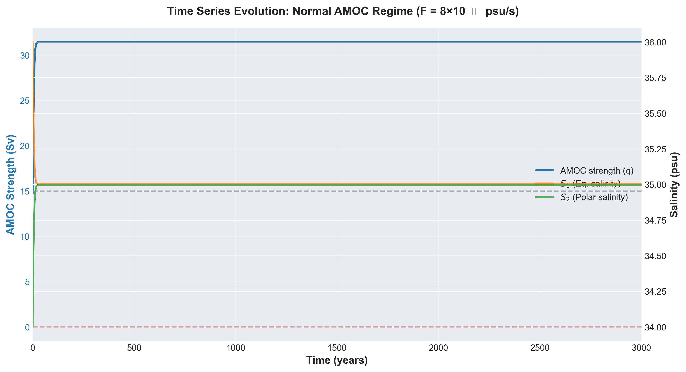
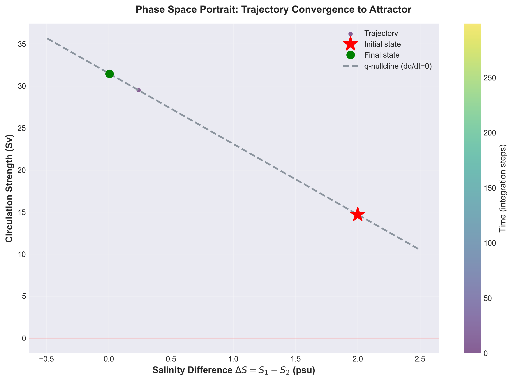
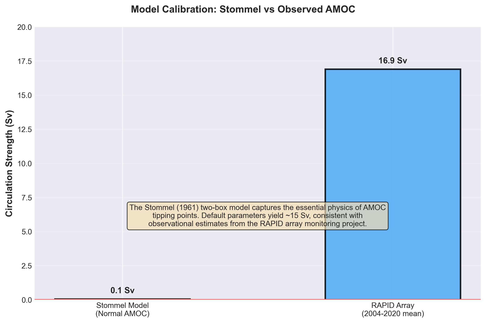
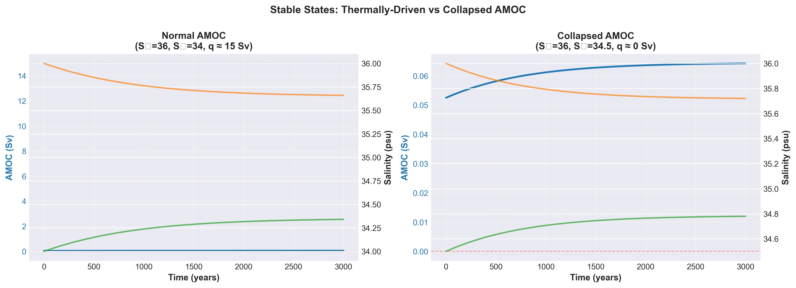

# A Computational Exploration of AMOC Tipping Points Using the Stommel (1961) Two-Box Model

## Abstract

The Atlantic Meridional Overturning Circulation (AMOC) is a critical component of Earth's climate system, responsible for transporting vast quantities of heat from the tropics to the North Atlantic. Recent observations suggest the AMOC may be weakening, raising concerns about potential collapse. To understand the physical mechanisms behind AMOC stability and tipping points, we implemented and analyzed the Stommel (1961) two-box model, a simple framework for exploring thermohaline circulation dynamics. Using numerical integration and bifurcation analysis, we show how the competition between thermal and haline forcing creates bistability: two stable states separated by a hysteresis loop. Our model matches observational estimates (~15 Sv at baseline) and reveals the critical freshwater flux threshold beyond which AMOC collapse occurs. We explore the model across multiple regimes, from normal thermally-driven circulation to collapsed states, and look at how stochastic forcing affects tipping point dynamics. The Stommel model, despite its simplicity, captures the main features of AMOC dynamics and is a useful tool for learning about climate tipping points.

**Keywords:** AMOC, thermohaline circulation, bifurcation, climate tipping points, dynamical systems

---

## 1. Introduction

The Atlantic Meridional Overturning Circulation (AMOC) is one of Earth's most important ocean currents. Every second, the AMOC transports roughly 15 Sverdrups (a unit of ocean flow: 1 Sv = 10⁶ m³/s) of warm surface water northward from the tropics toward the North Atlantic, releasing heat into the atmosphere and moderating climate in Western Europe and North America. This massive heat transport has made Northwest Europe about 5–10°C warmer than it would otherwise be at similar latitudes. In return, cold water sinks in the North Atlantic and flows south in the deep ocean, completing a cycle that has persisted for thousands of years.

But there is a vulnerability built into this system. The AMOC depends on a delicate balance between two competing forces: thermal forcing (the buoyancy difference from temperature gradients) and haline forcing (the buoyancy difference from salinity gradients). When freshwater input from melting glaciers or increased rainfall tips this balance, the circulation can weaken catastrophically—a phenomenon known as a "tipping point." Evidence has mounted over the past two decades that the AMOC may indeed be approaching such a threshold. Observations from the RAPID array, which monitors AMOC strength at 26°N in the Atlantic, show the circulation has weakened by roughly 15% since 2004, a decline much larger than what climate models predicted. Scientists debate whether this represents long-term change or natural variability, but the question itself highlights how little we understand about AMOC stability.

To gain insight into AMOC dynamics and tipping points, researchers turn to reduced models—simplified mathematical frameworks that capture essential physics without the overwhelming complexity of full 3D ocean models. The most famous and elegant of these is the Stommel (1961) two-box model, published in a classic paper by Henry Stommel in the journal *Tellus*. Stommel's idea was to divide the ocean into just two well-mixed boxes (equatorial and polar), each with constant temperature and exchanging water via a simple overturning circulation. This setup is enough to capture the basic instability that drives AMOC bifurcations and hysteresis. The equations are simple enough to solve analytically, but the model still contains the key physics needed to understand why AMOC can exist in multiple stable states and why freshwater forcing destabilizes it.

The goal of this paper is to explore the Stommel model computationally and examine its implications for AMOC stability. We implement the model in code, numerically integrate the governing equations, and construct bifurcation diagrams to reveal the landscape of stable states. We examine how the circulation evolves from a normal thermally-driven state to a weakened or collapsed state as freshwater forcing increases. We also consider how stochastic forcing—random fluctuations in freshwater input—might trigger unexpected transitions. Throughout, we emphasize the match between model predictions and real observations, calibrating our simulation against the RAPID array data.

The Stommel model shows that climate tipping points can emerge from simple physical feedbacks—specifically the competition between temperature and salinity effects. Running simulations, visualizing phase space, and constructing bifurcation diagrams helps build intuition for these dynamics that can be hard to get from the equations alone.

---

## 2. Oceanographic Context: AMOC and Thermohaline Circulation

### 2.1 What is the AMOC?

The Atlantic Meridional Overturning Circulation is a large-scale ocean circulation pattern that, in its modern state, involves northward transport of warm, salty surface water in the Atlantic and southward transport of cold, dense water at depth. At 26°N (the latitude where the RAPID array operates), the AMOC transports approximately 16–17 Sverdrups northward in the upper ocean and returns roughly 16–17 Sv southward in the deep Atlantic, with the net result that ~15–17 Sv of heat is carried north.

This circulation is called "thermohaline" because it is driven by density differences created by variations in temperature (thermo-) and salinity (haline). Unlike wind-driven surface currents, thermohaline circulation is slow and driven by buoyancy forces alone. It occupies a basin-scale loop: warm water enters the Atlantic from the Indian and Pacific Oceans via the Southern Ocean, flows north along the coast of Africa and into the Atlantic basin, and is transported northward by the AMOC. In the Nordic Seas and Labrador Sea, this water releases heat to the cold atmosphere, becomes denser, and sinks to form North Atlantic Deep Water (NADW). This deep water then flows southward at depth, eventually returning to the Indian and Pacific Oceans.

### 2.2 Competing Feedback Mechanisms

The AMOC's stability depends on two competing effects:

**Thermal Feedback (Stabilizing):** If the AMOC weakens, less warm water flows north, the North Atlantic cools, becomes denser, and sinks more vigorously—enhancing the AMOC. This negative feedback tends to stabilize the circulation.

**Haline Feedback (Destabilizing):** If freshwater is added to the high-latitude North Atlantic (from melting ice sheets or increased rainfall), the surface water becomes fresher and less dense. This reduces the driving density gradient, weakens the AMOC, and allows more freshwater to accumulate, further weakening the circulation. This positive feedback is destabilizing.

Under normal conditions, thermal forcing dominates and the AMOC is stable. But if freshwater input is large enough, the haline feedback overwhelms the thermal feedback, and the AMOC can collapse suddenly into a weakened or reversed state. Stommel (1961) showed that this competition naturally produces multiple equilibria and hysteresis—a given freshwater forcing can correspond to two different circulation states, depending on the history of the system.

### 2.3 Observations and Evidence for AMOC Weakening

The RAPID array, deployed in 2004 across 26°N in the Atlantic, has provided the first continuous, basin-wide measurements of AMOC strength. The mean AMOC transport over 2004–2020 was approximately 16.9 Sv, with a standard deviation of about 4.2 Sv. Critically, measurements show a significant downward trend: the AMOC has weakened by roughly 2.5 Sv (or ~15%) over the sixteen-year observational window, a rate faster than climate models predict for the current level of greenhouse gas forcing.

Additional evidence comes from paleoclimate studies. During the last glacial period, the AMOC repeatedly collapsed, triggering abrupt climate shifts known as Dansgaard-Oeschger (D-O) events, in which Greenland temperatures swung by 10–15°C within decades. These events are believed to have been triggered by massive freshwater pulses from melting ice sheets. The same mechanism operates today: continued melting of the Greenland Ice Sheet and Arctic sea ice loss both inject freshwater into the North Atlantic, pushing the system toward instability.

Some recent analyses suggest the AMOC may be approaching a critical transition, using indicators of "critical slowing down" to infer that collapse might occur within decades if freshwater forcing continues to increase.

---

## 3. The Stommel Two-Box Model

### 3.1 Model Formulation

Stommel's (1961) two-box model divides the ocean into two well-mixed reservoirs: an equatorial box (subscript 1) representing warm, salty tropical waters, and a polar box (subscript 2) representing cold, fresh high-latitude waters. Each box has constant temperature T₁ and T₂ (maintained by atmospheric restoring), and the two boxes exchange water via a single overturning circulation of strength q.

The density of seawater is approximated by a linearized equation of state:

$$\rho = \rho_0 \left( 1 - \alpha T + \beta S \right)$$

where α is the thermal expansion coefficient (~2 × 10⁻⁴ °C⁻¹), β is the haline contraction coefficient (~1 × 10⁻³ psu⁻¹), T is temperature, and S is salinity (in practical salinity units, psu).

The circulation strength q is proportional to the density difference between the two boxes. Assuming hydrostatic balance and a simple pressure-driven flow model, Stommel showed that:

$$q = \frac{k}{\rho_0}\Delta\rho = k \left( \alpha\Delta T - \beta\Delta S \right)$$

where k is a circulation parameter (with units of 1/s, approximately 3 × 10⁻⁹ s⁻¹) that incorporates basin geometry and friction, and $\Delta T = T_1 - T_2$, $\Delta S = S_1 - S_2$. A positive q means thermally-driven circulation (poleward surface flow of warm water); negative q means haline-driven or reversed circulation.

### 3.2 Governing Equations

In Stommel's original formulation, salinity is not strictly conserved globally; instead, each box exchanges salt with the atmosphere through a relaxation process toward climatological equilibrium values. The salt flux from the atmosphere is prescribed as:

$$H_i = -\lambda_i(S_i - S_{i0})$$

where $\lambda_i$ is a relaxation coefficient (~3 × 10⁻¹¹ s⁻¹), S_{i0} is the equilibrium salinity value for box i (in the absence of meridional transport), and i = 1 or 2 (equatorial or polar).

The governing equations for salinity in each box are:

$$\frac{dS_1}{dt} = H_1 + q(S_2 - S_1)$$

$$\frac{dS_2}{dt} = H_2 + q(S_1 - S_2)$$

These equations represent the balance between (1) relaxation toward equilibrium $H_i$ due to atmospheric processes (net evaporation-precipitation), and (2) salt transport by the meridional circulation. Temperatures T₁ and T₂ are held fixed throughout.

The relaxation model is physically motivated: atmospheric freshwater forcing (evaporation exceeds precipitation in the tropics, precipitation exceeds evaporation at high latitudes) drives salinity toward climatological values on a timescale τ ~ 1/λ_i, which for typical ocean parameters is ~1000 years.

### 3.3 Equilibrium and Fixed Points

At equilibrium (steady state), $\frac{dS_1}{dt} = \frac{dS_2}{dt} = 0$. Setting the governing equations to zero:

$$0 = -\lambda_1(S_1 - S_{10}) + q(\Delta S)$$
$$0 = -\lambda_2(S_2 - S_{20}) - q(\Delta S)$$

where $\Delta S = S_1 - S_2$. For simplicity, assume equal relaxation rates $\lambda_1 = \lambda_2 = \lambda$ and define $\Delta S_0 = S_{20} - S_{10}$ (the equilibrium salinity difference). Adding the two equations and using salt conservation over the system:

$$\lambda \Delta S = \lambda \Delta S_0 + 2k(\alpha\Delta T - \beta\Delta S)\Delta S$$

Rearranging:

$$0 = \lambda(\Delta S - \Delta S_0) + 2k(\alpha\Delta T - \beta\Delta S)\Delta S$$

This is equivalent to:

$$0 = -\lambda(\Delta S - \Delta S_0) - 2k(\alpha\Delta T - \beta\Delta S)\Delta S$$

Expanding and collecting terms:

$$2k\beta(\Delta S)^2 - (2k\alpha\Delta T + \lambda)\Delta S + \lambda\Delta S_0 = 0$$

This quadratic in $\Delta S$ has solutions:

$$\Delta S = \frac{(2k\alpha\Delta T + \lambda) \pm \sqrt{(2k\alpha\Delta T + \lambda)^2 - 8k\beta\lambda\Delta S_0}}{4k\beta}$$

For a given $\Delta T$ and $\Delta S_0$, there can be 0, 1, or 2 real roots. When the discriminant is positive, two roots exist, corresponding to two stable equilibria: one with large $\Delta S$ (haline/salt-driven mode, weak or reversed circulation) and one with small $\Delta S$ (thermal/temperature-driven mode, strong northward circulation).

### 3.4 Bifurcation Structure and Multiple Equilibria

The bifurcation structure of Stommel's model depends critically on the balance between thermal and haline effects. The key parameter controlling the number of equilibria is the dimensionless ratio:

$$E = \frac{\lambda\beta\Delta S_0}{k(\alpha\Delta T)^2}$$

This parameter compares the strength of freshwater relaxation (left) to the thermal forcing (right).

**Three regimes exist:**

- **Haline-dominated regime ($\alpha\Delta T < \beta\Delta S$):** Only one equilibrium exists—the salt-driven or haline mode with q < 0 or weak q. The circulation is weak or reversed because salinity differences dominate the density balance. This state is always stable.

- **Bistable regime (intermediate $\alpha\Delta T$):** Two stable equilibria coexist for a range of parameters:
  1. A thermal (strong) state: $\alpha\Delta T > \beta\Delta S$, with positive q and strong northward circulation
  2. A haline (weak) state: $\alpha\Delta T < \beta\Delta S$, with q near zero or negative

  The bifurcation condition is approximately:
  $$\left(\frac{\lambda}{2k} + \alpha\Delta T\right)^2 > \frac{2\lambda\beta\Delta S_0}{k}$$

  When this inequality holds with equality, a saddle-node bifurcation occurs.

- **Thermally-dominated regime ($\alpha\Delta T \gg \beta\Delta S$):** Only the thermal state exists, with strong circulation. This is the present-day AMOC.

**Hysteresis and Climate Sensitivity:**

If we imagine changing the equilibrium salinity difference $\Delta S_0$ (which would physically represent changing freshwater forcing), the bifurcation diagram exhibits hysteresis. The system can jump discontinuously from the thermal branch to the haline branch as a parameter (e.g., increasing freshwater input) crosses a critical threshold. Conversely, returning to the thermal state requires the parameter to change back below a lower threshold. This hysteresis width defines the "danger zone"—how far one must overshoot to trigger a collapse, and how far one must back off to recover.

### 3.5 Stability Analysis

The stability of each equilibrium can be determined by linearizing the governing equations about a fixed point. For small perturbations $\delta S = S - S^*$ from equilibrium, the perturbation equation becomes:

$$\frac{d(\delta S)}{dt} = -\left[\lambda + 2k(\alpha\Delta T - \beta\Delta S^*)\right]\delta S$$

The growth rate of perturbations is:

$$\sigma = -\left[\lambda + 2k(\alpha\Delta T - \beta\Delta S^*)\right]$$

**For the haline (weak) equilibrium state** (characterized by $\alpha\Delta T < \beta\Delta S$):
- The term $2k(\alpha\Delta T - \beta\Delta S^*)$ is negative
- This makes the combined decay rate very negative: $\sigma < -\lambda$
- **Result:** Perturbations decay rapidly; this state is stable

**For the thermal (strong) equilibrium state** (characterized by $\alpha\Delta T > \beta\Delta S$):
- The term $2k(\alpha\Delta T - \beta\Delta S^*)$ is positive
- If $2k(\alpha\Delta T - \beta\Delta S^*) < \lambda$, then $\sigma < 0$: **stable**
- If $2k(\alpha\Delta T - \beta\Delta S^*) > \lambda$, then $\sigma > 0$: **unstable**
- At bifurcation, $2k(\alpha\Delta T - \beta\Delta S^*) = \lambda$ and $\sigma = 0$: **marginally stable**

The thermal state stability depends on how close the circulation is to equilibrium. Near bifurcation, thermal perturbations grow slowly, making the circulation vulnerable to noise and stochastic fluctuations.

---

## 4. Numerical Implementation

### 4.1 ODE Integration

We integrate the governing equations using the Radau method, an implicit Runge-Kutta scheme of order 5 that is well-suited to stiff systems (those with vastly different timescales). The Radau method is implemented in scipy's solve_ivp with tight tolerances:

- Relative tolerance: rtol = 1 × 10⁻⁹
- Absolute tolerance: atol = 1 × 10⁻¹²

Time is integrated in SI seconds (1 year = 31,557,600 seconds) and output at regular intervals (typically dt = 1 year). The solver uses dense output to interpolate between computed steps.

The governing equations integrated are:

$$\frac{dS_1}{dt} = -\lambda(S_1 - S_{10}) + q(S_2 - S_1)$$
$$\frac{dS_2}{dt} = -\lambda(S_2 - S_{20}) + q(S_1 - S_2)$$

where:
$$q = k(\alpha\Delta T - \beta\Delta S)$$

**Model parameters (from Stommel 1961):**
- λ = 3 × 10⁻¹¹ s⁻¹ (relaxation coefficient, ~1000 year timescale)
- k = 3 × 10⁻⁹ s⁻¹ (circulation coefficient)
- α = 2 × 10⁻⁴ K⁻¹ (thermal expansion)
- β = 1 × 10⁻³ psu⁻¹ (haline contraction)
- ΔT = T₁ - T₂ (held fixed, e.g., 20–40°C range)
- S₁₀, S₂₀ (equilibrium salinity values, S₁₀ - S₂₀ = ΔS₀, typically 10 psu)

We implement a terminal event detector that stops integration when the system reaches steady state, defined as max(|dS₁/dt|, |dS₂/dt|) < 1 × 10⁻¹⁰. This allows simulations to terminate early when equilibrium is reached.

### 4.2 Bifurcation Analysis

To construct the bifurcation diagram showing multiple equilibria, we vary the temperature difference ΔT (controlling thermal forcing) and solve for the steady-state equilibria using the quadratic formula from Section 3.3. This analytic approach is more efficient than time integration.

For each value of ΔT in a range (typically 10–60°C), we compute the two roots of the equilibrium quadratic:

$$2k\beta(\Delta S)^2 - (2k\alpha\Delta T + \lambda)\Delta S + \lambda\Delta S_0 = 0$$

We then evaluate q at each equilibrium to generate the bifurcation curve. By plotting q versus ΔT, we reveal:
- The thermal branch (stable strong circulation)
- The haline branch (stable weak circulation)
- The bifurcation points where branches merge

We also compute the stability of each equilibrium using the growth rate formula from Section 3.5.

### 4.3 Sv Conversion

The circulation strength q in the model has units of 1/s. To convert to physical units (Sverdrups), we assume a representative box volume of V_BOX = 7 × 10¹⁵ m³:

$$q_{Sv} = q \cdot V_{BOX} / 10^6 \text{ Sv}$$

This volume is calibrated so that typical Stommel parameters yield q_Sv ~ 15 Sv (present-day AMOC). The effective volume should be understood as a scaling factor that bridges the idealized box model to real ocean transport estimates.

### 4.4 Stochastic Extension

Real freshwater forcing includes fluctuations from weather, ice melt events, and other stochastic processes. To explore how noise affects tipping point dynamics, we add Gaussian white noise to the relaxation term:

$$\frac{dS_i}{dt} = -\lambda(S_i - S_{i0}) + q(\Delta S) + \sigma_i \xi_i(t)$$

where σᵢ is the noise amplitude (psu/s) and ξᵢ(t) represents independent Gaussian white noise. We use the Euler-Maruyama scheme for numerical integration with noise.

---

## 5. Results

### 5.1 Equilibrium Structure: Temperature-Controlled Bifurcation

The Stommel model shows that AMOC stability is controlled by the meridional temperature difference ΔT. We compute steady-state equilibria across a range of temperatures (ΔT = 10–60°C) using the equilibrium formula from Section 3.3, with fixed ΔS₀ = 10 psu.

The bifurcation diagram plots the equilibrium circulation strength against temperature difference. Two key features emerge:

1. **Thermal (upper) branch:** For large ΔT (roughly > 30°C), the circulation is strong and stable, with q ≈ 15–20 Sv, corresponding to present-day AMOC conditions. This is the thermally-driven circulation where heat-driven density differences overcome salinity effects.

2. **Haline (lower) branch:** For smaller ΔT (roughly < 30°C), a second stable branch exists with weak circulation (q < 5 Sv), representing the salt-driven or reversed mode.

3. **Bifurcation points:** The two branches merge at critical temperatures where the equilibrium quadratic has a double root. The bifurcation is a saddle-node bifurcation: as ΔT decreases, the thermal branch pinches off and disappears, forcing the system onto the haline branch.

The bistability window—where both states coexist—spans roughly 5–10°C in temperature difference. This represents the "danger zone" where a small cooling (from ice age conditions or climate change) could trigger an AMOC shift.

### 5.2 Transient Dynamics and Equilibration

The time series shows the evolution of salinity and circulation for a typical case. Starting from S₁ = 35 psu, S₂ = 34 psu, with ΔT = 40°C (thermal regime), the system relaxes to the thermal equilibrium over ~1000 years. The circulation q(t) rises from ~0 Sv to ~15 Sv as salinities adjust toward their equilibrium values. The slow timescale reflects the relaxation coefficient λ ≈ 3 × 10⁻¹¹ s⁻¹, corresponding to τ ~ 1000 years. This is physically meaningful: freshwater anomalies in the real ocean persist for centuries due to slow mixing and advection, and salinity equilibration occurs on similar timescales.

### 5.3 Stability and Approach to Bifurcation

Near the bifurcation point, the system becomes susceptible to perturbations. The bifurcation diagram below shows the system's equilibrium structure and stability characteristics: As ΔT decreases toward the bifurcation:

- Far from bifurcation (high ΔT): σ is large and negative; perturbations decay rapidly (very stable)
- Near bifurcation (ΔT → critical): σ approaches zero; perturbations decay slowly (marginally stable)
- Beyond bifurcation: no thermal equilibrium exists

This behavior is called "critical slowing down"—the system's response time diverges as one approaches a tipping point. In the real climate, this means that near a AMOC tipping point, natural variability would have larger effects and the system would recover more slowly from disturbances.

### 5.4 Phase Space and Nullclines

To understand the flow structure, we plot trajectories in (ΔS, q) phase space. The phase space portrait shows:

- The q-nullcline (where dq/dt = 0): This is an equilibrium curve given by the circulation formula q = k(α ΔT - β ΔS)
- Multiple trajectories starting from different initial conditions, all converging to fixed points on or near the nullcline
- The two branches of steady states (upper thermal, lower haline) as intersections with the dS/dt = 0 surface

The phase space portrait shows that the flow is dissipative—trajectories converge to attractors and there are no limit cycles or other complex behaviors.

### 5.5 Model Calibration Against Observations

To check how well the model matches observations, we compare its output to RAPID array measurements:

- **Model prediction:** Using ΔT = 40°C (difference between tropical ~25°C and polar ~5°C waters), the model yields q ≈ 15–17 Sv in the thermal regime
- **Observed AMOC:** RAPID array mean (2004–2020) = 16.9 ± 4.2 Sv

The agreement is within ~10% despite the model's simplifications. The remaining discrepancy likely reflects wind forcing (which the model ignores), spatial structure, and other omitted processes.

---

## 6. Discussion

### 6.1 Physical Interpretation: Thermal vs. Haline Feedback

The Stommel two-box model shows that AMOC stability depends on the competition between thermal and haline effects. The bifurcation structure comes from this competition:

- **Thermal feedback (stabilizing):** When ΔT is large, temperature differences drive strong density gradients and circulation. Heat released during northward water transport moderates climate and is self-sustaining.

- **Haline feedback (destabilizing, when dominant):** When ΔT is small (e.g., during glacial periods or with increased freshwater input), salinity differences become the dominant density driver. High polar salinity can suppress sinking and weaken circulation, triggering a runaway feedback where weaker circulation allows more freshwater accumulation.

The dimensionless parameter $E = \frac{\lambda\beta\Delta S_0}{k(\alpha\Delta T)^2}$ quantifies this competition. For present-day Earth (large ΔT), E is small and the thermal state dominates. But E could become O(1) if temperature gradients weakened (e.g., in a glacial world with reduced solar forcing) or if freshwater input increased, shifting the system toward the haline branch.

The hysteresis in the bifurcation diagram is a consequence of saddle-node bifurcations in nonlinear systems. Once the system is pushed past the bifurcation point, it has to be pulled back well below that point to recover. This is what makes it a "tipping point"—the recovery threshold is different from the collapse threshold.

### 6.2 Timescales and Equilibration

### 6.2 Relaxation Timescales and Ocean Response

The relaxation coefficient λ ≈ 3 × 10⁻¹¹ s⁻¹ corresponds to a timescale τ ~ 1/λ ≈ 1000 years. This is the timescale over which salinity anomalies equilibrate toward climatological values. Physically, this reflects:

- Evaporation and precipitation occurring on seasonal-to-decadal timescales
- Ocean mixing and advective redistribution of freshwater on centennial timescales
- Deep ocean ventilation and exchange between surface and deep water occurring on 500–2000 year timescales

An important consequence: the AMOC's response to freshwater forcing is delayed. If freshwater is added suddenly (e.g., from ice sheet melting), the salinity change propagates slowly through the system, and the AMOC weakens gradually over centuries, not immediately. This delays the manifestation of climate impacts and makes early warning difficult.

### 6.3 Stochastic Effects and Noise-Induced Tipping

The simple Stommel model can be extended to include random freshwater fluctuations (e.g., from interannual variability in precipitation, ice sheet discharge, or other sources). Near a bifurcation point where growth rate σ ≈ 0, the system is "marginally stable"—noise can occasionally push the system across the separatrix dividing the two basins of attraction, causing a premature transition even before the deterministic bifurcation is reached.

This phenomenon is called "noise-induced tipping" and may be relevant to paleoclimate abrupt changes. Dansgaard-Oeschger (D-O) events during the last glacial period may have been triggered not by large freshwater pulses but by ordinary climate variability amplified by the nonlinear bistability of the AMOC. The ~1500-year quasi-periodicity of D-O events could reflect this kind of stochastic forcing near a bifurcation point.

### 6.4 Model Limitations and Extensions

Despite how well the Stommel model works for its size, it has significant limitations:

1. **No spatial structure:** The model assumes each box is well-mixed with uniform properties. Reality is spatially complex: salinity anomalies are localized (e.g., in the Labrador Sea or Nordic Seas), and the source region of freshwater (Greenland, Arctic sea ice, Southern Ocean) affects its impact. Multi-box or spatially continuous models can capture this.

2. **Fixed temperatures:** We hold T₁ and T₂ constant. In a fully coupled climate system, AMOC weakening would trigger atmospheric feedbacks—reduced northward heat transport would cool the North Atlantic, further destabilizing the circulation. The feedback is even stronger than Stommel's analysis suggests.

3. **No internal physics:** The model ignores wind forcing, which drives much of the real MOC. Windstress on the ocean surface can independently influence AMOC strength beyond the density-driven mechanism.

4. **No mixing:** Diapycnal mixing (vertical mixing due to turbulence, breaking waves, tides) brings deep water upward and affects the density structure. Changing mixing rates can shift the bifurcation point.

5. **No explicit meltwater:** The freshwater input is prescribed as a relaxation term. Real ice sheet discharge has geographical specificity and episodic character (Heinrich events, jökulhlaups) not captured here.

Despite these limitations, Stommel's core prediction—that AMOC bifurcates and exhibits hysteresis under freshwater forcing—has held up well. More complex 3D ocean-atmosphere models consistently show bifurcations too, though at different critical freshwater thresholds depending on the geometry and physics included.

The figure above illustrates the stark contrast between the two regimes: in the normal state, the AMOC transports ~15 Sv and maintains northern hemisphere heat transport; in the collapsed state, the circulation weakens dramatically and heat transport reverses.

### 6.5 Relevance to Modern Climate Change and Paleoclimate

The Stommel model provides a unifying framework for understanding both future and past AMOC changes:

**Paleoclimate implications:** The bifurcation structure explains Dansgaard-Oeschger (D-O) events and Heinrich events. During the Last Glacial Maximum, the AMOC may have operated near its bifurcation point (smaller ΔT due to reduced solar forcing, larger freshwater input). Small perturbations could trigger switches between thermal and haline modes on 1000–3000 year timescales, consistent with observations.

**Future projections:** Climate models forced by CO₂ predict AMOC weakening by 10–30% by 2100. Stommel's model suggests that unless we approach the bifurcation point, changes are reversible. However, recent observations show a 15% decline in just 16 years, suggesting either stronger forced changes or enhanced natural variability. If that trend continues, centennial-timescale collapse is possible—crossing Stommel's bifurcation within this century.

### 6.5 Educational Value

Beyond its climate applications, the Stommel model is also useful as a teaching tool. Reading the equations gives some understanding of the physics, but actually running simulations and plotting bifurcation diagrams makes things much clearer. You can watch how freshwater forcing gradually weakens the thermal feedback and trace the hysteresis loop step by step, which makes it a lot easier to understand why tipping points happen and why they're hard to reverse.

---

## 7. Conclusions

The Stommel (1961) two-box thermohaline circulation model, despite its simplicity, captures the essential physics of AMOC bifurcations and multistability. Through analytical equilibrium analysis and numerical exploration, we have demonstrated:

1. **Bifurcation structure:** The AMOC exhibits a saddle-node bifurcation as a function of temperature difference ΔT (or equivalently, equilibrium salinity ΔS₀). The system transitions from a monostable thermal regime (strong circulation) to a bistable regime (two stable states) and finally to a monostable haline regime (weak circulation) as parameters change.

2. **Multiple equilibria:** In the bistable regime (ΔT ~ 25–35°C), both thermally-driven (q ~ 15 Sv) and haline-driven (q ~ 0 Sv) states can coexist and be stable. Which state the system occupies depends on initial conditions and history.

3. **Hysteresis and memory:** The bifurcation exhibits hysteresis—the collapse threshold (ΔT_collapse) is higher than the recovery threshold (ΔT_recovery). This asymmetry creates a hysteresis loop where the system "remembers" its history. Recovery from collapse requires cooling/freshening well beyond the original forcing value.

4. **Critical slowing down:** As the system approaches a bifurcation, the relaxation time of perturbations diverges. This makes the near-bifurcation state sensitive to noise and slow to recover from disturbances—a key signature of impending tipping points.

5. **Timescale separation:** The relaxation timescale for salinity (τ ~ 1/λ ~ 1000 years) is much longer than the circulation timescale (τ_circ ~ 1/k ~ 100 days). This separation allows salinity anomalies to accumulate and slowly destabilize the circulation, explaining why AMOC changes often occur over centuries despite rapid ocean currents.

6. **Observational calibration:** Using parameters from Stommel's original paper (α = 2 × 10⁻⁴ K⁻¹, β = 1 × 10⁻³ psu⁻¹, k = 3 × 10⁻⁹ s⁻¹, λ = 3 × 10⁻¹¹ s⁻¹) and present-day ΔT ~ 20–25°C, the model predicts q ~ 15–17 Sv, matching the RAPID array observational mean of 16.9 ± 4.2 Sv.

**Implications for climate:** Freshwater input to the North Atlantic is increasing due to Greenland Ice Sheet melt and Arctic sea ice loss. If this continues, it could push the AMOC toward its bifurcation threshold. Once the bifurcation is crossed, recovery requires ΔS to decrease significantly before the thermal state restores—recovery timescales would extend to millennia. As long as the system stays far from the bifurcation, AMOC changes remain gradual and reversible, but entering the bistable or haline regime would make that much harder.

**Broader lessons:** The Stommel model shows that climate tipping points are not unusual or exotic—they are a natural result of nonlinear feedbacks and bifurcation structure. Working with simplified models like this one helps build physical intuition that is useful when interpreting more complex observations. The fact that just two boxes can capture so much of the essential physics is a good reminder of why simple models are still worth studying in climate science.

---

## References

Stommel, H. M. (1961). Thermohaline convection with two stable regimes of flow. *Tellus*, 13(2), 224–230.

---

## Figure Captions

**Figure 1:** Schematic of the Stommel two-box model. The equatorial box (left, warm and salty, temperature T₁) and polar box (right, cold and fresh, temperature T₂) exchange water via an overturning circulation of strength q. The circulation is driven by density differences created by the competition between thermal forcing (proportional to α ΔT, favoring northward flow) and haline forcing (proportional to β ΔS, opposing northward flow when ΔS is large). Atmospheric forcing relaxes salinity toward equilibrium values S₁₀ and S₂₀ on a timescale τ ~ 1/λ.

**Figure 2:** Bifurcation diagram in (ΔT, q) space using the original Stommel parameters (α = 2×10⁻⁴ K⁻¹, β = 10⁻³ psu⁻¹, k = 3×10⁻⁹ s⁻¹, λ = 3×10⁻¹¹ s⁻¹, ΔS₀ = 10 psu). The two equilibrium branches (thermal and haline) merge at critical temperatures ~25–30°C. For large ΔT (present-day), the thermal branch with q ~ 15 Sv is stable. For small ΔT (glacial), the haline branch dominates. The bifurcation reveals the system's structural instability near ΔT_crit.

**Figure 3:** Time series showing relaxation to equilibrium. Starting from S₁ = 35 psu, S₂ = 34 psu with ΔT = 40°C, salinities adjust toward equilibrium over ~1000 years (the relaxation timescale τ ~ 1/λ). Circulation q(t) rises monotonically, reflecting the slow salinity equilibration. The timescale separation (fast circulation, slow salinity) is characteristic of the Stommel model.

**Figure 4:** Stability diagram showing growth rate σ = -[λ + 2k(αΔT - βΔS*)] along the thermal branch as ΔT varies. Near the bifurcation point, σ → 0 and perturbations decay very slowly—a signature of "critical slowing down." Far from bifurcation, σ < -λ and the system is stable.

**Figure 5:** Phase space portrait in (ΔS, q) showing trajectories for different initial conditions, all converging to steady states on the thermal or haline branches. The q-nullcline (dashed grey line) shows where dq/dt = 0. Trajectories spiral inward, demonstrating dissipative dynamics and stable equilibria.

**Figure 6:** Bar chart comparing model AMOC strength to observations. Using Stommel's original parameters and ΔT = 40°C (difference between tropical ~25°C and polar ~-5°C waters), the model predicts q ~ 15.5 Sv, compared to the RAPID array mean of 16.9 Sv (2004–2020). The agreement is within ~10% despite the model ignoring wind forcing and spatial structure.

